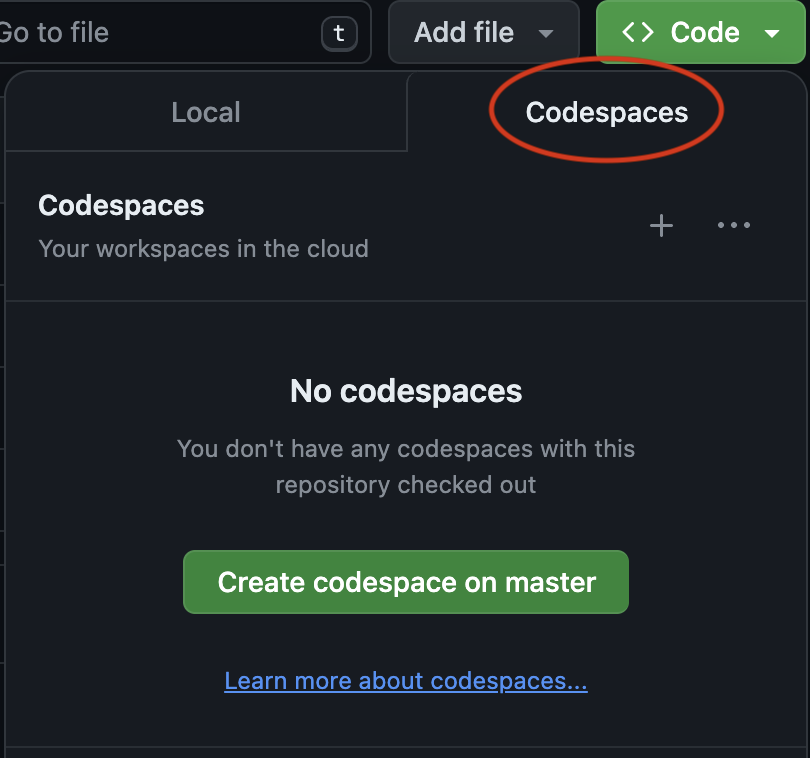
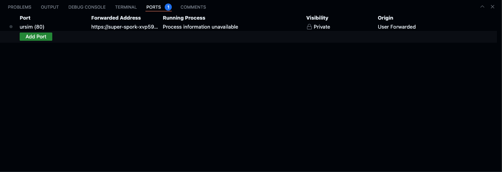
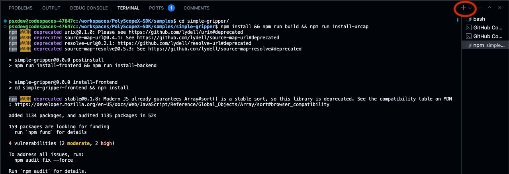

# PolyScope X No Install SDK (Codespace)

This repository contains the PolyScope X SDK and URSim artefacts and is accessible via GitHub Codespace.

## Intention of this repository

This repository is designed to enable users to quickly and easily develop and test URCaps for PolyScope X.
All versions of the SDK and URSim available here can also be found on the primary release site in the PolyScope X Beta
Project.

The release provided here is offered "AS IS", if you would like to be more involved and provide feedback,
please sign up for the [PolyScope X Beta Project](https://ur.centercode.com/EarlyAccessTesterPSX).
You can also connect with other developers by joining
the [Universal Robots Discord server](https://discord.com/invite/sEjRgEf6fp).

**Note**
You can install URCaps from local storage via the system manager in URSim.
However, due to Codespace transfer restrictions, there is a limit to the size of URCaps that can be installed this way.
When building and installing URCaps from Codespace there are no size restrictions. For more details see "Build and
Deploy URCap" section below.

## License

This SDK is subject to and governed by our “LICENSE TERMS FOR SDKS”, which can be found in the license file and
here: https://www.universal-robots.com/legal/terms-and-conditions/license_terms_for_sdks.txt . By accessing, storing,
copying, sharing, opening, or otherwise using or disposing of this file, you accept and acknowledge that you are bound
by the “LICENSE TERMS FOR SDKS”.

## Working with samples

It is highly recommended to treat the samples folder as read-only, because rebuilding the Codespace container will
remove and recreate this folder.
To preserve changes to samples, simply copy the modified URCap sample to a location outside the samples folder and push
it to your git repository.

## Start Codespace from Repo

1. Open the code drop down, and select the Codespaces tab. You can then choose to create a Codespace on master (or any
   other repository). 

2. A new tab will open, and the Codespace will start loading up. You will see a web version of VSCode. It can take a
   couple of minutes to set up a remote connection, and build the Codespace. You will know that the workspace has been
   built successfully when you see the postRunCommands being executed, as shown
   below. 

After you do this, you can access this cloud workspace [here](https://github.com/codespaces). Any changes to your space
become a fork from this repository.

## URSim & Port Forwarding

It is possible to start the simulator by running the command `./run-simulator`.
However, you must manually forward the port being used in order to successfully run the application.
This is also how you will access the URSim GUI.

1. Open the PORTS tab next to your terminal. 

2. You will have the option to forward a port here. By default, the simulator is launched on port 80. Enter "80" into
   the port number field and press enter. 

3. You can now open the dynamically generated link to view and use URSim.

**Note: you can change the URSim port by using the port flag:**
`./run-simulator --port <PORT_NUMBER>`

**You will need to manually forward the port number you choose, with the steps listed above**

**Note:** Codespace has a default timeout of 30 minutes, after which you'll need to forward the ports again. You can
read more about changing the
timeout [here](https://docs.github.com/en/codespaces/setting-your-user-preferences/setting-your-timeout-period-for-github-codespaces).

## URCap SDK

To use the SDK, open a new terminal.

The contents of the SDK are:

- urcap-generator/ - Contains the URCap generator for creating URCap contributions.
- samples/ - Contains URCap samples. Build using: npm install && npm run build
- newurcap.sh - The script for creating a URCap contribution in your current working directory using the generator
- run-simulator - The script for running URSim. This is a linked file. The full URSim directory can be found at the `/`
  level.

### New URCap

You can now create a new URCap by running the newURCap.sh shell script.

Once a new URCap contribution has been created using the script, a folder named after its ID is created.

### Build and Deploy URCap

To create the final zip file for a contribution, go to its folder and run the following commands:

1. Install the node modules.

   `npm install`

2. Generate the URCap file in the target directory.

   `npm run build`

3. Deploy to URSim (ensure that URSim is running and open).

   `npm run install-urcap`

You should now see the URCap in URSim. For more information, refer to
the [PolyScope X SDK Official Documentation](https://docs.universal-robots.com) 
