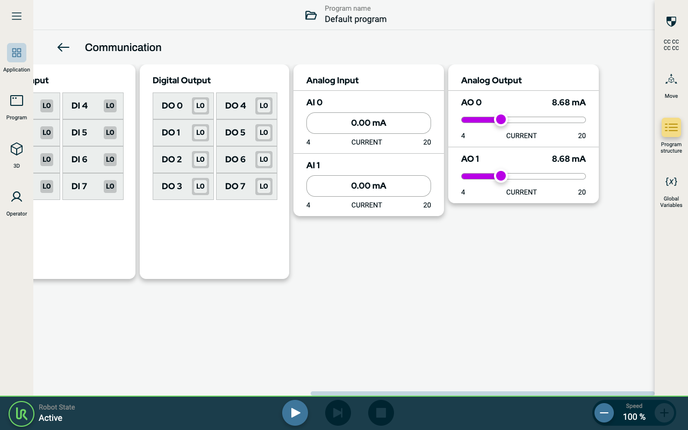

# Simple ROS2 Node Sample

This sample contains an example of how to use ROS2 in a backend. It takes the value from the analog output pin 0 and maps that to pin 1.

Refer to the ROS2 sections in the [official documentation](https://docs.universal-robots.com/) for more information.



## Build and Deploy Sample

In order to build and deploy this sample, use the commands below. A rebuild of the project is required to see any changes made to the source code.  If you are deploying the URCap to URSim, ensure that you have started the simulator.

### Dependencies

Run this command to install the dependencies of the project.

```shell
npm install
```

### Build

Run this command to build the contribution type.

```shell
npm run build
```

### Installation

Run this command to install the built URCap to the simulator.

```shell
npm run install-urcap
```

Run this command to install the built URCap to the robot.

```shell
npm run install-urcap -- --host <robot_ip_address>
````

## Backend Contribution

### manifest.yaml

The backend is called in the `manifest.yaml` file with the code below.

```yaml
  containers:
    - id: simple-ros2-node
      image: simple-ros2-node:latest
      mounts:
        - mount: tmpfs:/root/.ros
          access: rw
```

### ROS2 Topics and Services

The sample exposes the following topics and services.

| ROS interface  | name                        | Type                                  | Description                                                    |
|----------------|-----------------------------|---------------------------------------|----------------------------------------------------------------|
| Publish Topic  | /control_box_analog_io      | urinterfaces.msg/AnalogIOStateStamped | Standard analog outputs' domain (voltage or current) and value |
| Expose Service | /set_standard_analog_output | urinterfaces.srv/SetAnalogOutput      | Set single analog output domain (current or voltage) and value |

The `main.py` file sets up the ROS2 topics, services, and other functionalities in the URCap.

### Backend Output

Having built and installed the URCap in the simulator you can open your terminal to see the output from the backend:

```shell
docker exec -it ursim-polyscopex-runtime-1 bash
```

You can find more documentation on the `docker exec` functionality [here](https://docs.docker.com/reference/cli/docker/container/exec/).

Your terminal prompt should have switched from `psxdev@<vsc_container_id>:/pwd/$ ` to `<ursim_container_id>:/pwd/# `, meaning you can now execute commands within your simulator docker container.

List the active docker containers with

```shell
docker ps
```

View the backend output by using the container ID associated with the `universal-robots_simple-ros2-node_simple-ros2-node` image (e.g. 8e3)

```shell
docker logs -f <container_id>
```

An expected output from the docker log would be:

```shell
[INFO] [1734358190.968928292] [UR8888.simple_ros2_node]: Using Robot Controller: UR8888
[INFO] [1734358190.970320375] [UR8888.simple_ros2_node]: Simple ROS2 Node, a sample where standard analog out 0 is sent to standard analog out 1
[INFO] [1734358205.798732757] [UR8888.simple_ros2_node]: Incoming request urinterfaces.msg.AnalogIOStateStamped(header=std_msgs.msg.Header(stamp=builtin_interfaces.msg.Time(sec=1734358205, nanosec=789842000), frame_id=''), io_state=urinterfaces.msg.AnalogIO(analog_inputs=[urinterfaces.msg.Analog(pin=0, domain=0, value=0.0), urinterfaces.msg.Analog(pin=1, domain=0, value=0.0)], analog_outputs=[urinterfaces.msg.Analog(pin=0, domain=0, value=0.012609999626874924), urinterfaces.msg.Analog(pin=1, domain=0, value=0.004000000189989805)]))
[INFO] [1734358205.809045049] [UR8888.simple_ros2_node]: Incoming request urinterfaces.msg.AnalogIOStateStamped(header=std_msgs.msg.Header(stamp=builtin_interfaces.msg.Time(sec=1734358205, nanosec=803669000), frame_id=''), io_state=urinterfaces.msg.AnalogIO(analog_inputs=[urinterfaces.msg.Analog(pin=0, domain=0, value=0.0), urinterfaces.msg.Analog(pin=1, domain=0, value=0.0)], analog_outputs=[urinterfaces.msg.Analog(pin=0, domain=0, value=0.012609999626874924), urinterfaces.msg.Analog(pin=1, domain=0, value=0.012609999626874924)]))
```

## Frontend Contribution

This sample does not contain any frontend contributions.

### Frontend Output

To interact with this URCap, toggle the Analog Output 0 slider. Analog Output 1 should match the value of AO0.